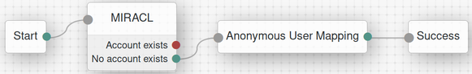

# MIRACL Trust Node for Authentication Trees

[MIRACL Trust](https://miracl.com) is a service that acts as password-free secured online identity provider utilizing patented elliptic curve cryptography.
MIRACL Trust can be configured as external Access Manager OIDC identity provider utilizing Authentication Trees model. The step-by-step manual is outlined below.

## Integration manual
The steps of reference integration constructing are listed below.

* Deploy Access Manager 6 as described in the [ForgeRock manual](https://backstage.forgerock.com/docs/am/6/quick-start-guide).
* Create OIDC interface at [MIRACL Trust Management Portal](https://trust.miracl.cloud) as described in the [MIRACL Trust manual](https://devdocs.trust.miracl.cloud/register-create-new-app/). Remember its application client ID and secret.
* Go to AM realm dashboard. Open "Authentication - Trees".
* Click "(+) Create Tree".

* Fill the form.
    + Tree Name: `"MIRACL"`

* Click "Create".

The GUI tree builder will appear. Initially it contains two connected nodes - `"Start"` and `"Failure"`.

* In the "Components" section at the left, find "OpenID Connect" one and drag it to the working area. Do the same for "Anonymous User Mapping" and "Success" components. You should have the following components at the working area:
    + "Start"
    + "OpenID Connect"
    + "Anonymous User Mapping"
    + "Success"

* Click the "OpenID Connect" component. Properties list will appear at the right.

* Fill the form.
    + Node Name: `"MIRACL"`
    + Client Id: `The OIDC application client ID from Management Portal`
    + Client Secret: `The OIDC application client secret from Management Portal`
    + Authentication Endpoint URL: `"https://api.mpin.io/authorize"`
    + Access Token Endpoint URL: `"https://api.mpin.io/oidc/token"`
    + User Profile Service URL: `"https://api.mpin.io/oidc/userinfo"`
    + OAuth Scope: `"openid"`
    + Redirect URL: `The URL where AM is deployed`
    + Social Provider: `"MIRACL"`
    + Auth ID Key: `"id"`
    + Use Basic Auth: `Off`
    + Account Provider: `"org.forgerock.openam.authentication.modules.common.mapping.DefaultAccountProvider"`
    + Account Mapper: `"org.forgerock.openam.authentication.modules.common.mapping.JsonAttributeMapper"`
    + Attribute Mapper: `"org.forgerock.openam.authentication.modules.common.mapping.JsonAttributeMapper"`
    + Add the following entry to Account Mapper Configuration. You have to click "Add" button first for subform to popup and click "+" button after finished:
        + `"sub"`: `"uid"`
    + Add the following entries to Attribute Mapper Configuration. You have to click "Add" button first for subform to popup and click "+" button after finished:
        + `"sub"`: `"uid"`
        + `"email"`: `"email"`
    + Save Attributes in the Session: `Off`
    + OpenID Connect Mix-Up Mitigation Enabled: `Off`
    + Token Issuer: `https://api.mpin.io`
    + OpenID Connect Validation Type: `JWK URL`
    + OpenID Connect Validation Value: `https://api.mpin.io/oidc/certs`

* Now nodes should be connected in the given way. Node input is located at the left, and output(s) at the right. Connection is performed by dragging some output to a required input. 
    + Connect "Start" node output to "MIRACL" node input.
    + Connect "MIRACL" node output saying "No account exists" to "Anonymous User Mapping" node input.
    + Connect "Anonymous User Mapping" node output to "Success" node input.
    
    

* Click "Save".

## Test the integration

* Go to AM realm dashboard. Open "Authentication - Settings".
* Go to "Core" tab.
    + Select Organization Authentication Configuration: `"MIRACL"`
* Click "Save Changes".

* Once you change that, the default log in to AM will be `"MIRACL"` tree. If you want to go back to the administrator window to make changes to the configuration go to AM URL by appending `"/console"` (for example, `"http://openam.partner.com:8080/openam/console"`). This will use the administrator service to log in to AM (which should be the `"ldapService"`).

* Logout from Access Manager and try to login again.
* AM should automatically redirect you to the MIRACL identity provider.

# Disclaimer
The sample integration setup described herein is provided on an "as is" basis, without warranty of any kind, to the fullest extent permitted by law. MIRACL does not warrant or guarantee the individual success developers may have when following the integration manual on their development platforms or in production configurations.
MIRACL does not warrant, guarantee or make any representations regarding the use, results of use, accuracy, timeliness or completeness of any data or information relating to the integration manual. MIRACL disclaims all warranties, expressed or implied, and in particular, disclaims all warranties of merchantability, and warranties related to the integration manual, or any service or software related thereto.
MIRACL shall not be liable for any direct, indirect or consequential damages or costs of any type arising out of any action taken by you or others related to the integration manual.
